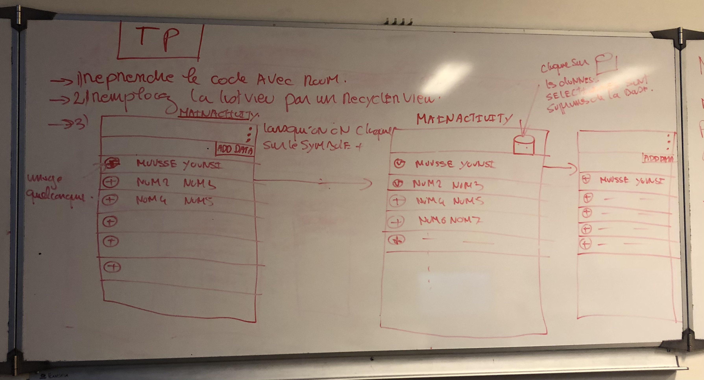

= TP 22 Android Room ViewModel Repo

exercice 3 +
lorsque je click sur l'image view non selectionné de la row, +
alors l'image view de la row change en selected,
et apparait la poubelle à la place du menu. +
lorsque je click sur la poubelle cela supprime les personnes selectionnés. +